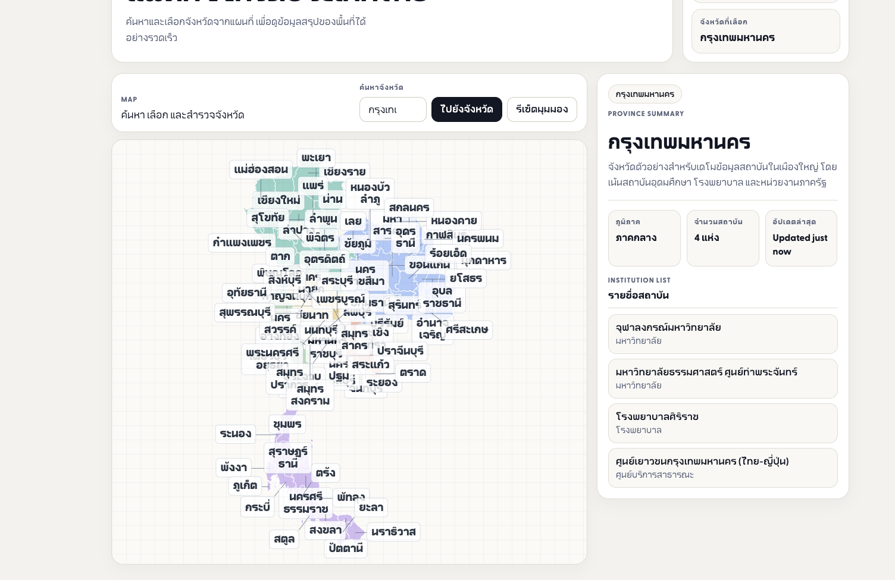

# จบมาเรียนไหนดี?

เว็บแนะนำสถาบันอุดมศึกษาในไทยแบบ **Data-Driven**  
ช่วยให้การเลือกที่เรียนไม่ใช่แค่ “ความรู้สึก” แต่มีข้อมูลรองรับมากขึ้น

---

## โปรเจกต์นี้คืออะไร

`จบมาเรียนไหนดี?` คือเว็บอินเทอร์แอกทีฟที่รวม
- แผนที่ประเทศไทยแบบเลือกพื้นที่ได้ทันที
- ตัวกรองสำคัญที่เด็กจบใหม่ใช้ตัดสินใจจริง (`สายการเรียน / งบประมาณ / พื้นที่`)
- รายชื่อสถาบันที่แนะนำจากข้อมูลจริงของภาครัฐ

เป้าหมายคือทำให้การเริ่มต้นหามหาวิทยาลัย “ง่ายขึ้น เร็วขึ้น และเห็นภาพรวมชัดขึ้น”

---

---

## ใช้ข้อมูลอะไร

ระบบแนะนำในเวอร์ชันนี้สร้างจาก Open Data ด้านอุดมศึกษาของไทย เช่น
- รายชื่อสถาบันอุดมศึกษา (แยกจังหวัด)
- ข้อมูลนักศึกษาปัจจุบันรายสาขา
- ต้นทุนต่อหัวต่อปีของหลักสูตร

ข้อมูลดิบถูกแปลงและรวมเป็น dataset กลางเพื่อให้เว็บตอบสนองเร็วและใช้งานง่าย

---

## เหมาะกับใคร

- นักเรียนที่กำลังหาคณะที่ใช่และพื้นที่ที่เหมาะ
- ผู้ปกครองที่อยากดูตัวเลือกแบบมีข้อมูลรองรับ
- ครูแนะแนวที่อยากมีเครื่องมือช่วยเริ่มบทสนทนา
- นักพัฒนา/นักวิเคราะห์ที่สนใจ EdTech + Open Data

---

## วิสัยทัศน์ต่อไป

โปรเจกต์นี้ตั้งใจพัฒนาไปสู่ระบบแนะแนวเต็มรูปแบบ เช่น
- แนะนำสถาบันตามเป้าหมายอาชีพ
- เทียบตัวเลือกหลายแห่งแบบ side-by-side
- เพิ่มสัญญาณเชิงคุณภาพ (แนวทางหลักสูตร, สภาพแวดล้อมการเรียน, โอกาสงาน)

---

## สรุปสั้น ๆ

นี่ไม่ใช่แค่ “เว็บแผนที่มหาวิทยาลัย”  
แต่มันคือเครื่องมือช่วยตอบคำถามสำคัญของเด็กไทยว่า

> **“จบมาเรียนไหนดี?”**
